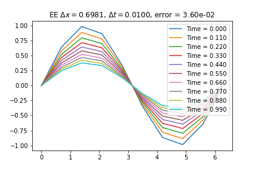
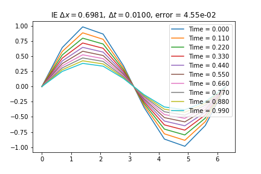
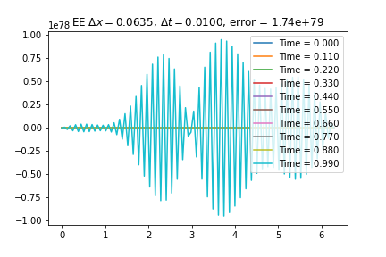
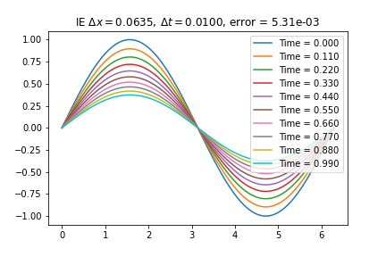
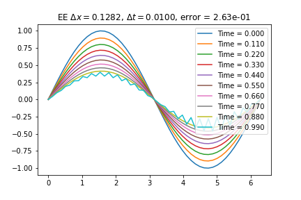
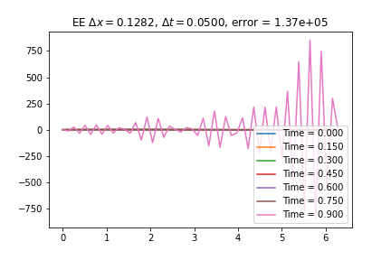
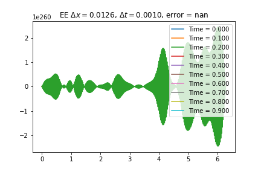

<!--
title: Lecture 020 Elliptic
paginate: true
_class: titlepage
-->

# Elliptic and Parabolic Differential Equations and Finite Difference Methods

---

# Poisson equation

Given a domain $\Omega \in \mathbb R ^{d}$ where $d>1$, we seek for $u:\Omega \to \mathbb R$ solution of 

$$-\Delta u(x) = f(x) \text{ for } x\in \Omega,$$
where $\Delta$ is the Laplacian operator, i.e., $\partial^2_{x_1} +\partial^2_{x_2 } + \dots +\partial^2_{x_d}$.

We say the equation is homogeneous if $f\equiv 0$. The homogeneous Poisson equation is called Laplace equation.

### Physical applications
* Heat conduction ($u$ temperature),
* Elastic membrane subject to a body force $f$ ($u$ is the displacement),
* Electric potential distribution ($u$) due to a charge $f$.

---

## Physical derivation 

$u$ is a concentration, at equilibrium there will be zero net flux $\mathbf{F}$ through the boundary of any regular subdomain $S\subset \Omega$, so
$$
\int_{\partial S} \mathbf{F}\cdot \mathbf{n} \textrm{d}\Gamma = 0,
$$
using the Gauss-Green theorem, we have that
$$
\int_S \text{div} \mathbf{F} \textrm{d} x =\int_{\partial S} \mathbf{F}\cdot \mathbf{n} \textrm{d}\Gamma = 0, 
$$
so $\text{div} \mathbf{F}=0$. In many applications it is reasonable to assume that the flux is proportional to the gradient of the concentration (chemical concentration, heat), from the higher concentration region to the lower ones $\mathbf{F}=-a \nabla u.$

Substituting we get
$$ \text{div} \mathbf{F} = -\text{div} ( a \nabla u) = - a \Delta  u=0.$$

---

## Boundary conditions
To obtain uniqueness of the solution, we need to enforce some extra constraints.
### Dirichlet boundary conditions
$$u=g \text{ on }\partial \Omega.$$
If $g\equiv 0$, then they are called homogeneous Dirichlet BC. 

Elastic application -> imposing a given displacement. 

### Neumann boundary conditions
$$\nabla u \cdot \textbf{n} = \frac{\partial u}{\partial \textbf{n}}  = h \text{ on }\partial \Omega.$$
$\textbf{n}$ is the normal vector going out of the domain $\Omega$ in each point of the boundary $\partial \Omega$.

Elastic application -> prescribed surface traction or stress on the boundary. 

--- 

## Boundary conditions

### Geometric Combinations
$$
\begin{align*}
    &\partial\Omega = \Gamma_D \cup \Gamma_N, \qquad \Gamma_D^\circ \cap \Gamma_N^\circ = \emptyset\\
&\begin{cases}
    u=g \text{ on }\Gamma_D\\
    \nabla u \cdot \textbf{n} = g \text{ on }\Gamma_N.
\end{cases}
\end{align*}
$$

### Physical Combinations: Robin boundary
$$
\begin{align*}
    \nabla u \cdot \textbf{n} + \gamma u = r \text{ on }\Gamma_R.
\end{align*}
$$

---

# Heat equation

Given a domain $\Omega \in \mathbb R$ we look for a solution $u:\Omega \times \mathbb R^+ \to \mathbb R$ solution of 

$$\partial_t u(t,x) -a \partial_{xx} u(t,x) = f(t,x),$$
with $a>0$.

### Physical applications
* Heat conduction ($u$ temperature, $a$ thermal conductivity, $u_0$ initial temperature, Dirichlet = Thermal bath, Neumann = temperature change rate ),
* Elastic membrane subject to a body force $f$ ($u$ is the displacement),
* Electric potential distribution ($u$) due to a charge $f$.

## Difference with Elliptic
* Variation in time

---

## Cauchy problem
We couple the PDE with initial conditions (IC) at time $t=0$ AND boundary conditions (either Neumann or Dirichlet) for all times $t\in\mathbb R^{+}$. 
$$
\begin{cases}
    \partial_t u(t,x) -a \partial_{xx} u(t,x) = f(t,x), & t>0, x\in\Omega\\
    u(0,x)=u_0(x), & x\in\Omega,\\  
    u(t,x) = u_D(t,x), & \forall t \in \mathbb R^+, x\in\Gamma_D \subset \partial \Omega,\\
    \partial_x u(t,x) \cdot \mathbf{n} = u_N(t,x), & \forall t \in \mathbb R^+, x\in\Gamma_N \subset \partial \Omega.
\end{cases}
$$

### Periodic boundary conditions
Alternatively, for boundary conditions one can impose periodic conditions, i.e., if $\Omega = [a,b]$, then 
$$u(t,a)=u(t,b)$$
 for all $t\in \mathbb R^+$.

---

# Today's Working Problems
## Poisson equation in 1D
$$
\begin{cases}
    \Omega = [0,1]\\
    -u''(x) = f(x) \text{ in } (0,1)\\
    u(0)=u(1)=0
\end{cases}
$$

## Heat equation in 1D
$$
\begin{cases}
    \Omega = [0,1]\\
    \partial_t u(t,x) -a \partial_{xx} u(t,x) = f(t,x), & t>0, x\in(0,1)\\
    u(0,x)=u_0(x), & x\in(0,1),\\
    u(t,0)=u(t,1)=0, & \forall t \in \mathbb R^+, x\in\{0,1\}.
\end{cases}
$$

## Cahn-Hilliard in 1D
$$
\begin{cases}
    \Omega = [0,1]\\
    \partial_t u(t,x) -a \partial_{xx} u(t,x) = (u(x)-u^3(x)), & t>0, x\in(0,1)\\
    u(0,x)=u_0(x), & x\in(0,1),\\
    u(t,0)=u(t,1)=0, & \forall t \in \mathbb R^+, x\in\{0,1\}.
\end{cases}
$$

---
<!--
title: Lecture 021 Finite Difference Elliptic
paginate: true
_class: titlepage
-->

# Finite Difference for Elliptic Differential Equations

---

We have seen how the equations are defined. In some cases there are exact solutions, and we have found some. But in many other cases there is no known analytical solution.

Numerical analysis comes in help to find **approximations** of such solutions. 

We start with the simplest approach one can think of: 
## Finite Difference

---

## Finite Difference

Consider a boundary value 1D problem on $\Omega=[a,b]$ defined as 
$$F(x,u,\partial_x u , \partial_{x}^2 u,\dots ,\partial^{k}_x u)=0 + BCs.$$

Since the computer represents only discrete states and we want to approximate a function $u$, we can do it on a simple grid:
$$
a=x_0<x_1<\dots<x_i<\dots x_N = b
$$
with values 
$$
u_i\approx u(x_i).
$$

To transform the PDE into a system of $N+1$ equations for our $N+1$ unknown, we have to decide how to deal with the derivatives in a discrete sense.

For simplicity, we will consider regular grids with $x_{i+1}-x_i=h$ for all $i=0,\dots,N-1$.

---

Let's start with the first derivative $\partial_x u(x)$!

### Definition: divided difference for first derivative
Let $u:[a,b]\to \mathbb R$ be a bounded function, let $x\in [a,b]$ and $h\in\mathbb R^+$. We define the **forward divided difference** of $f$ in $x$ with spacing $h$ by
$$
\delta_{h,+}u(x) = \frac{u(x+h)-u(x)}{h},
$$
for $x+h\in[a,b]$ and, we define the **backward divided difference** of $f$ in $x$ with spacing $h$ by
$$
\delta_{h,-}u(x) = \frac{u(x)-u(x-h)}{h},
$$
for $x-h\in[a,b]$ and the **central divided difference** of $f$ in $x$ with spacing $h$ by
$$
\delta_{h}u(x) = \frac{u(x+h/2)-u(x-h/2)}{h},
$$
for $x+h/2,x-h/2\in[a,b]$.

---

### Property
If $u$ is has the left derivative $u'_-(x)$, the right derivative $u'_+(x)$ and the derivative $u'(x)$ in $x$, then
$$\lim_{h\to 0} \delta_{h,-}u(x) = u'_-(x),\qquad \lim_{h\to 0} \delta_{h,+}u(x) = u'_+(x),\qquad \lim_{h\to 0} \delta_{h}u(x) = u'(x).$$

So, given a fixed $h$, we can use these divided differences as approximations of the derivatives. 
* How good are these approximations?
* Which one is preferable?

### Taylor expansion!
Suppose that $u$ is regular enough, let's expand the divided differences in $x$ and see what we get.
$$
\begin{align*}
&\delta_{h,-}u(x) - u'(x) = \frac{u(x)-u(x-h)}{h}-u'(h) = \frac{u(x) - \left(u(x) - h u'(x) +\frac{h^2}2 u''(\xi)  \right)}{h} - u'(x)=\frac{h}{2} u''(\xi)\\
&\lvert\delta_{h,-}u(x) - u'(x) \rvert \leq \frac{h}{2} \max_{\xi\in [a,b] } |u''(\xi)|. 
\end{align*}
$$

---

## Lemma
$$
\begin{align*}
&\lvert\delta_{h,-}u(x) - u'(x) \rvert \leq \frac{h}{2} \max_{\xi\in [a,b] } |u''(\xi)|;\\
&\lvert\delta_{h,+}u(x) - u'(x) \rvert \leq \frac{h}{2} \max_{\xi\in [a,b] } |u''(\xi)|;\\
&\lvert\delta_{h}u(x) - u'(x) \rvert \leq \frac{h^2}{24} \max_{\xi\in [a,b] } |u'''(\xi)|.
\end{align*}
$$

### Proof: exercise

### Errors of divided difference
* Central divided difference has a quadratic error
* Sided divided differences have a linear error

Error-wise central is better, but physics may not be central, time for example flows in one direction, so it's complicated to use values of $u$ in the future (see Explicit Euler), also in space one might have favorite directions (we will see strong transport phenomena).

---

## Order of accuracy
The order of accuracy of an approximation of a function $f$ describes how the error decreases as the grid spacing or time step decreases. The order of accuracy is determined by the leading term in the error expansion.

### Definition
Let $f_h(x)$ be an approximation of a bounded function $f:[a,b]\to \mathbb R$ in a point $x$ with discretization parameter $h>0$. We say that $f_h(x)$ is convergent if 
$$
\lim_{h\to 0} (f_h(x)-f(x))=0.
$$

We say that $f_h(x)$ converges to $f(x)$ with order $p$ with respect to $h$ if 
$$
|f_h(x) - f(x)| = O( h^p).
$$

* $\delta_{h,-}u$ and $\delta_{h,+}u$ are first order approximations of $\partial_x u$
* $\delta_{h}u$ is a second order approximation of $\partial_x u$
 

---

## Divided differences for two-point boundary problems

Let's start with a simple boundary value problem:
find $u:[a,b]\to \mathbb R$ such that $-u''(x)=f(x)$ for $x\in[a,b]$ and $u(a)=u(b)=0$, where $f:[a,b]\to \mathbb R$ is a given function. Suppose that we cannot find an analytical solution, how can we approximate it?

We try to approximate the solution in some equispaced points $x_i$ with $i=0,\dots,N$ with $x_{i+1}=x_i+h$, $x_0=a$ and $x_N=b$.

We have seen that we can approximate the second derivative with divided differences
$$
-u''(x_i) \approx \frac{u(x_{i+1}) - 2u(x_i) + u(x_{i-1})}{h^2} \qquad \forall i=0,\dots, N.
$$

So, we can look at an approximation of $u(x_i)\approx u_i$ for all $i=0,\dots,N$ that solves the following system
$$
-\frac{u_{i+1} - 2u_i + u_{i-1}}{h^2} = f(x_i) \qquad \forall i=1,\dots, N-1.
$$
Then, we can use the information from BC to set $u_0=u_N=0$.

---

## Matrix form
$$
-\frac{u_{i+1} - 2u_i + u_{i-1}}{h^2} = f(x_i) \qquad \forall i=1,\dots, N-1.
$$

We can write this system in matrix form as
$$
\underbrace{-\frac{1}{h^2}\begin{bmatrix}
-2 & 1 & 0 & \dots & 0\\
1 & -2 & 1 & \dots & 0\\
0 & 1 & -2 & \dots & 0\\
\vdots & \vdots & \vdots & \ddots & \vdots\\
0 & 0 & 0 & \dots & -2
\end{bmatrix}}_{=:A}
\underbrace{\begin{bmatrix}
u_1\\
u_2\\
u_3\\
\vdots\\
u_{N-1}
\end{bmatrix}}{=:U}
=
\underbrace{\begin{bmatrix}
f(x_1)\\
f(x_2)\\
f(x_3)\\
\vdots\\
f(x_{N-1})
\end{bmatrix}}_{=:F}
$$
We can use our favourite linear solver to find the solution $U$ from $AU=F$.

---

## Inhomogeneous boundary conditions
Suppose now that the Dirichlet BC are now different from zero, i.e., $u(a)=u_0=\alpha$ and $u(b)=u_N=\beta$. How can we modify the system?
Clearly the first equation for $u_1$ becomes
$$
-\frac{u_0-2u_1+u_2}{h^2} = f(x_1) \Longrightarrow -\frac{\alpha-2u_1+u_2}{h^2} = f(x_1).
$$
But how can we incorporate this into the system without interfering with the other equations?
Add an artificial equation for $u_0$ and $u_N$: $u_0 = \alpha \qquad \text{and} \qquad u_N = \beta.$
Then, we can add the equations for $u_0$ and $u_N$ to the system and solve the system as before.
$$
\underbrace{-\frac{1}{h^2}\begin{bmatrix}
-h^2 & 0 & 0 &0 & \dots & 0& 0\\
1 & -2 & 1 & 0 & \dots & 0& 0\\
0 & 1 & -2 & 1 & \dots & 0& 0\\
0 & 0 & 1 & -2 & \dots & 0& 0\\
\vdots &\vdots & \vdots & \vdots & \ddots & \vdots & \vdots\\
0 & 0 & 0 & 0 & \dots & -2 & 1\\
0 & 0 & 0 & 0 & \dots & 0&-h^2
\end{bmatrix}}_{=:A}
\underbrace{\begin{bmatrix}
u_0\\
u_1\\
u_2\\
u_3\\
\vdots\\
u_{N-1}\\
u_N
\end{bmatrix}}{=:U}
=
\underbrace{\begin{bmatrix}
\alpha\\
f(x_1)\\
f(x_2)\\
f(x_3)\\
\vdots\\
f(x_{N-1})\\
\beta
\end{bmatrix}}_{=:F}
$$

---

## Neumann Boundary Conditions
Suppose now that the BC are of Neumann type on the left, i.e., $\partial_x u(a)=\alpha$ and $u(b)=\beta$. How can we modify the system?
We have to approximate at the border the derivative with a divided difference.
$$
\partial_x u(a) \approx \frac{u_1-u_0}{h} = \alpha. 
$$

---

## Exercise
Find the finite difference approximation of the homogeneous Dirichlet Poisson problem on a non uniform grid, i.e., $x_{i+1}-x_{i}\neq x_{i}-x_{i-1}$.

---

### Existence and uniqueness of the solution?
Let's just focus on the matrix $A$ given by the 1D Poisson problem with Dirichlet BCs (or mixed Dirichlet-Neumann). 
We can see that the matrix (excluding the Dirichlet BC) is 
* symmetric 
* diagonally dominant
* diagonal is positive
* hence, it is positive definite ($\Longrightarrow$ coercive!)
* This implies that the matrix is invertible and the solution exists and is unique.

---

# Finite Difference Discretization of $\partial_t u - \partial_{xx} u=0$
* Domain in space $\Omega=[a,b]$ and time $[0,T]$
* Grid in space $a=x_0<x_1<\dots <x_i<\dots<x_{N_x}=b$
* Grid in time $0=t^0<t^1<\dots<t^n<\dots<t^{N_t}=T$

### Explicit Euler

$$
\frac{u^{n+1}_i-u^n_i}{\Delta t} - \frac{u_{i+1}^n-2u_i^n+u_{i-1}^n}{\Delta x^2}=0 
$$

### Implicit Euler

$$
\frac{u^{n+1}_i-u^n_i}{\Delta t} - \frac{u_{i+1}^{n+1}-2u_i^{n+1}+u_{i-1}^{n+1}}{\Delta x^2}=0 
$$

### Crank-Nicolson

$$
\frac{u^{n+1}_i-u^n_i}{\Delta t} - \frac{u_{i+1}^{n+1}-2u_i^{n+1}+u_{i-1}^{n+1}}{2\Delta x^2}- \frac{u_{i+1}^{n}-2u_i^{n}+u_{i-1}^{n}}{2\Delta x^2}=0 
$$

---

## Numerical solutions
### Explicit Euler
$$
\frac{u^{n+1}_i-u^n_i}{\Delta t} - \frac{u_{i+1}^n-2u_i^n+u_{i-1}^n}{\Delta x^2}=0 
$$
* Explicit -> no systems
### Implicit Euler
$$
\frac{u^{n+1}_i-u^n_i}{\Delta t} - \frac{u_{i+1}^{n+1}-2u_i^{n+1}+u_{i-1}^{n+1}}{\Delta x^2}=0 
$$
* Linear system 
$$
LHS =I-\frac{\Delta t}{\Delta x^2} D^2 = \begin{pmatrix}
1+2\frac{\Delta t}{\Delta x^2} &-\frac{\Delta t}{\Delta x^2} & 0&\dots & \dots\\
-\frac{\Delta t}{\Delta x^2} &1+2\frac{\Delta t}{\Delta x^2} &-\frac{\Delta t}{\Delta x^2} &\dots & \dots\\
\vdots & \ddots & \ddots & \ddots &\vdots\\
0&\dots & \dots &-\frac{\Delta t}{\Delta x^2} &1+2\frac{\Delta t}{\Delta x^2}     
\end{pmatrix} \qquad RHS = u^n
$$

---

### Crank-Nicolson
$$
\frac{u^{n+1}_i-u^n_i}{\Delta t} - \frac{u_{i+1}^{n+1}-2u_i^{n+1}+u_{i-1}^{n+1}}{2\Delta x^2}- \frac{u_{i+1}^{n}-2u_i^{n}+u_{i-1}^{n}}{2\Delta x^2}=0 
$$
* Linear system 
$$
LHS = I-\frac{1}{2}\frac{\Delta t}{\Delta x^2} D^2 = \begin{pmatrix}
1+\frac{\Delta t}{\Delta x^2} &-\frac{\Delta t}{2\Delta x^2} & 0&\dots & \dots\\
-\frac{\Delta t}{2\Delta x^2} &1+\frac{\Delta t}{\Delta x^2} &-\frac{\Delta t}{2\Delta x^2} &\dots & \dots\\
\vdots & \ddots & \ddots & \ddots &\vdots\\
0&\dots & \dots &-\frac{\Delta t}{2\Delta x^2} &1+\frac{\Delta t}{\Delta x^2}     
\end{pmatrix}
$$
$$
RHS = u^n +\frac12 \frac{\Delta t}{\Delta x^2} D^2 u^n
$$

---

## Consistency
### Explicit Euler

$$
\begin{align*}
&\frac{u^{n+1}_i-u^n_i}{\Delta t} - \frac{u_{i+1}^n-2u_i^n+u_{i-1}^n}{\Delta x^2}=0 \\
e_{\Delta t, \Delta x}^{EE} =&\frac{u(t^{n+1},x_i)-u(t^n,x_i)}{\Delta t} - \frac{u(t^n,x_{i+1})-2u(t^n,x_i)+u(t^n,x_{i-1})}{\Delta x^2} \\
=&\partial_t u(t^n,x_i) +\frac{\Delta t}2 \partial_{tt}u(t^n,x_i) - \partial_{xx} u(t^n,x_i) -\frac{\Delta x^2}{12} \partial_{xxxx}u(t^n,x_i)+O(\Delta t^2) + O(\Delta x^3) \\
=&   \frac{\Delta t}2 \partial_{tt}u(t^n,x_i) -\frac{\Delta x^2}{12} \partial_{xxxx}u(t^n,x_i)+O(\Delta t^2) + O(\Delta x^3) = O(\Delta t) + O(\Delta x^2)
\end{align*}
$$

Second order in space and first order in time

---

## Consistency
### Crank-Nicolson

$$
\begin{align*}
&\frac{u^{n+1}_i-u^n_i}{\Delta t} - \frac{u_{i+1}^n-2u_i^n+u_{i-1}^n}{2\Delta x^2}- \frac{u_{i+1}^{n+1}-2u_i^{n+1}+u_{i-1}^{n+1}}{2\Delta x^2}=0 \\
e_{\Delta t, \Delta x}^{CN} =&\frac{u(t^{n+1},x_i)-u(t^n,x_i)}{\Delta t} - \frac{u(t^n,x_{i+1})-2u(t^n,x_i)+u(t^n,x_{i-1})}{2\Delta x^2}      \\
&- \frac{u(t^{n+1},x_{i+1})-2u(t^{n+1},x_i)+u(t^{n+1},x_{i-1})}{2\Delta x^2} \\
=&\partial_t u(t^n,x_i) +\frac{\Delta t}2 \partial_{tt}u(t^n,x_i) - \partial_{xx} u(t^n,x_i) -\frac{\Delta x^2}{12} \partial_{xxxx}u(t^n,x_i)\\
&- \frac{\Delta t}{2} \underbrace{\partial_{txx} u(t^n,x_i)}_{=\partial_{tt}u} -\frac{\Delta t}{2}\frac{\Delta x^2}{12} \partial_{xxxxt}u(t^n,x_i)+O(\Delta t^2) + O(\Delta x^4) \\
=&  \frac{\Delta t}2 \partial_{tt}u(t^n,x_i)-\frac{\Delta t}2 \partial_{tt}u(t^n,x_i) +O(\Delta t^2) + O(\Delta x^2) = O(\Delta t^2) + O(\Delta x^2)
\end{align*}
$$
Second order in space and time

---

# Example
$$
\begin{align*}
    &\begin{cases}
        \partial_t u - \partial_{xx}u =0,\\
        u_0(x) = \sin(x)\qquad x\in [0,2\pi],\\
        u(t,0) =u(t,2\pi)= 0. \qquad t \in \mathbb{R}^+,
    \end{cases}\qquad
    &u(t,x)=e^{-t}\sin(x)\qquad x\in [0,2\pi],\qquad t \in \mathbb{R}^+.
\end{align*}
$$

---

## Explicit Euler: Stability issues $\Delta t< C \Delta x ^2$

---

# Nonlinear problems (Cahn-Hilliard)

$$ \partial_t u - \partial_{xx} u = u-u^3.$$

### Implicit Euler

$$
\frac{u^{n+1}_i-u^n_i}{\Delta t} - \frac{u_{i+1}^{n+1}-2u_i^{n+1}+u_{i-1}^{n+1}}{\Delta x^2}= u_i^{n+1}-(u_i^{n+1})^3 
$$

Stable, but nonlinear!
### Nonlinear solver at each time step, e.g. Newton's method
$$
\begin{align*}
&\text{Find } u^{n+1} \text{ such that } F(u^{n+1})=0, \text{ where } F:\mathbb R^{N_x}\to \mathbb R^{N_x},\\
&F(u^{n+1})_i = \frac{u^{n+1}_i-u^n_i}{\Delta t} - \frac{u_{i+1}^{n+1}-2u_i^{n+1}+u_{i-1}^{n+1}}{\Delta x^2}- u_i^{n+1}+(u_i^{n+1})^3\\
\end{align*}
$$

---

# Newton's method for nonlinear problems (1/2)
$$
\begin{align*}
&F(u^{n+1})_i = \frac{u^{n+1}_i-u^n_i}{\Delta t} - \frac{u_{i+1}^{n+1}-2u_i^{n+1}+u_{i-1}^{n+1}}{\Delta x^2}- u_i^{n+1}+(u_i^{n+1})^3\\
&J_{u^{n+1}}F(u^{n+1})_{ij} = \partial_{u^{n+1}_j} F(u^{n+1})_i = \frac{\delta_{ij}}{\Delta t} - \frac{\delta_{i+1,j}-2\delta_{i,j}+\delta_{i-1,j}}{\Delta x^2}- \delta_{ij}+3(u_i^{n+1})^2 \delta_{ij}
\end{align*}
$$

$$
\begin{align*}
&J_{u^{n+1}}F(u) =\frac{I}{\Delta t}-\frac{D^2}{\Delta x^2} - I + 3\textrm{diag}(u^2)I  =\\
&\begin{pmatrix}
\frac{1}{\Delta t}+2\frac{1}{\Delta x^2}-1+3(u_1)^2 &-\frac{1}{\Delta x^2} & 0&\dots & \dots\\
-\frac{1}{\Delta x^2} &\frac{1}{\Delta t}+2\frac{1}{\Delta x^2}-1+3(u_2)^2 &-\frac{1}{\Delta x^2} &\dots & \dots\\
\vdots & \ddots & \ddots & \ddots &\vdots\\
\vdots & \ddots & \ddots & \ddots &\vdots\\
0&\dots & \dots &-\frac{1}{\Delta x^2} &\frac{1}{\Delta t}+2\frac{1}{\Delta x^2}-1+3(u_{N_x})^2     
\end{pmatrix}
\end{align*}
$$

---

# Newton's method for nonlinear problems (2/2)

Solve iteratively the linear systems
$$
\begin{align*}
&J_{u^{n+1}}F(u^{(k)}) \delta u^{(k)} = -F(u^{(k)})\\
&u^{(k+1)} = u^{(k)} + \delta u^{(k)}
\end{align*}
$$
Starting from $u^{(0)}=u^n$.

Until convergence, i.e., $\|F(u^{(k)})\|<\varepsilon$ for some tolerance $\varepsilon>0$ or until $\delta u^{(k)}$ is small enough, i.e., $\|\delta u^{(k)}\|<\varepsilon$.

---

# LET'S CODE!!! (Finally)

