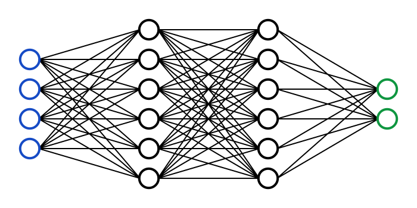
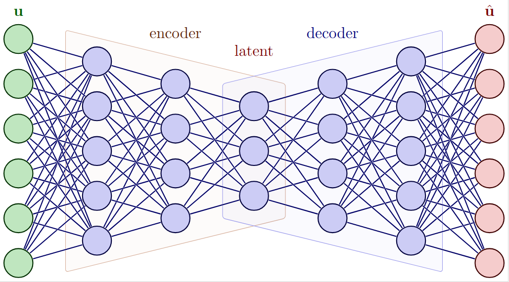
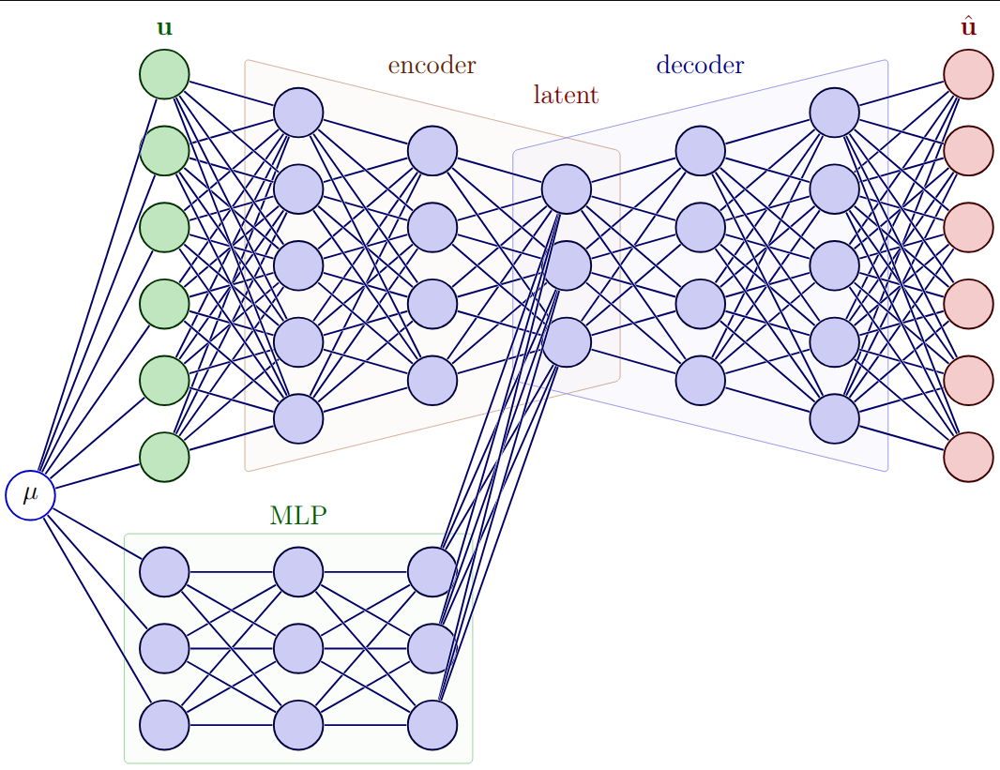
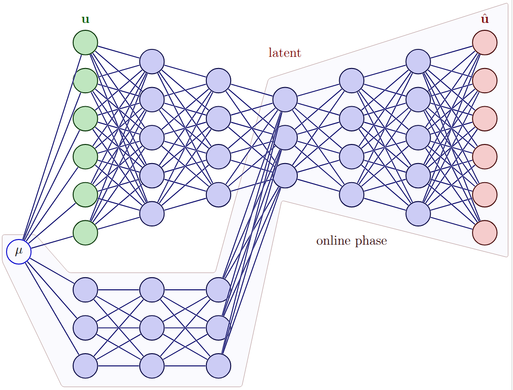
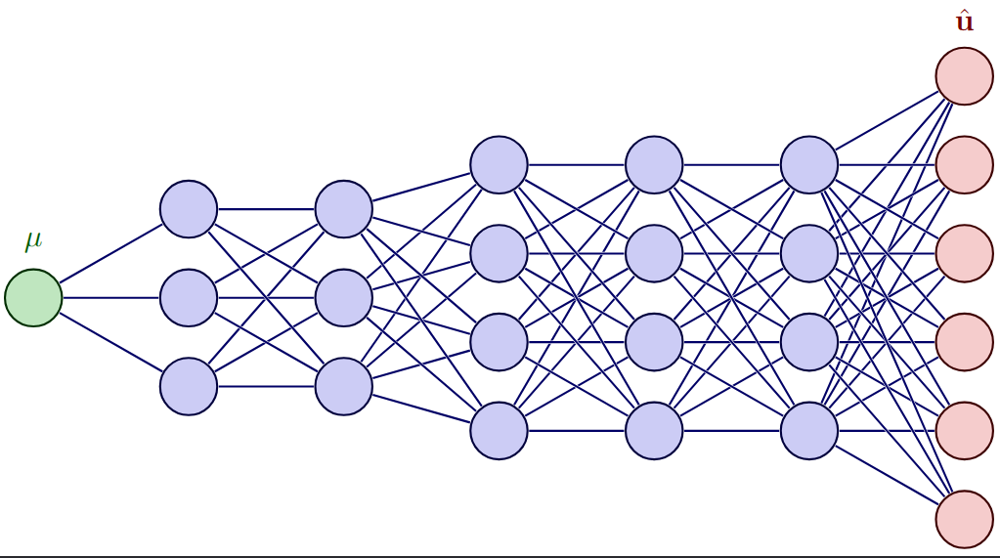
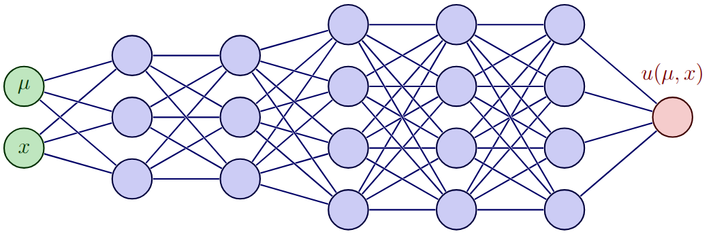

<!--
title: Lecture Neural Networks
paginate: true
_class: titlepage
-->

# Neural Networks for Model Order Reduction

---

# Neural Networks

Neural networks (NNs) are a class of machine learning algorithms that are inspired by the structure and function of the human brain. They consist of interconnected nodes (neurons) organized in layers, where each connection has an associated weight.

From a mathematical point of view, a NN is a function defined as a composition of simpler functions. In the picture, the blue circles are the **input** variables, the green circles are the **output** variables, all the lines represent affine transformations and the black circles are nonlinear (simple) **activation functions**.
The layers in black are called **hidden layers**.

---

# Neural Networks

$$NN(x) := \sigma( A_N\dots \sigma(A_2\sigma(A_1x+b_1)+b_2)\dots +b_N)$$
where 
* $N$ is the number of layers of the NN called the **depth** 
* $n_i$ $i=0,\dots,N$ is the number of nodes in each layer
* $\sigma$ is a nonlinear activation function
* $A_i\in \mathbb R^{n_i\times n_{i-1}}$ for $i=1,\dots,N$ and $b_i\in \mathbb R^{n_i}$ are the weights and biases of the network. These have to be determined, they are not known a priori.

---

## Activation functions
Activation functions $\sigma$ are typically very simple functions, of which the derivatives are easily computable, e.g., 
* Rectifying linear unit ReLU$(x)$ = $x\,\chi_{x>0} + 0 \, \chi_{x\leq 0}$
* LeakyReLU = $x\,\chi_{x>0} + ax \, \chi_{x\leq 0}$ with $0<a<1$
* $\tanh(x)$
* Softplus(x) = $\log(1+e^x)$
* Sigmoid(x) = $\frac{1}{1+e^{-x}}$
* Many more...

---

# What are the NN used for?

As you have seen in the previous slides, we might aim at approximating functions, i.e. doing **regression**.

Another task typically required to NN is the **classification**.

We focus on the regression task:

Find weights $A_i$ and biases $b_i$, which are often collected into the parameters $\theta$, that best approximate a function $f$:
$$
\min_{\theta } \lVert NN_\theta(\cdot) -f (\cdot) \rVert
$$
in some norm.

---

# Neural Networks properties
Though very simple, NN have proven to be very powerful in the last years. In particular, they can approximate functions very well, within few layers.

## Universal Approximation Theorem
A feedforward neural network $NN:\mathbb R^{n_0} \to \mathbb R$ with a single hidden layer containing a finite number $n_1$ of neurons can approximate any continuous function $f$ on compact subsets of $\mathbb R^{n_0}$ to any desired degree of accuracy. In other words, for any $\varepsilon>0$ there exists $n_1 \in \mathbb N$ such that
$$
\max_{x\in K\subset \mathbb R^{n_0}} \min_{A,b} |NN(x) - f(x)| < \varepsilon.
$$

## Optimality of universal approximation theorem
More precise estimations are available, but they are far from the capability of these networks. What has been observed is that adding layers increases very quickly the approximation capability of the network.

---

# Training a Neural Network: cost function
In order to make $NN$ close to a function $f$, we have to train it to learn the *right* weights $A_i$ and biases $b_i$, to minimize the error between the output of the network and the function $f$.
This is done by minimizing the cost function on a training set $X_{train} = \lbrace (x_i, y_i) \rbrace_{i=1}^{N_{train}} = (\mathbf{x},\mathbf{y})$:
$$
\mathcal L(\theta) = \frac{1}{N_{train}} \sum_{i=1}^{N_{train}} \left( NN(x_i) - y_i \right)^2
$$
where $\theta\in \mathbb R^{N_{param}}$ is the vector of all weights  $A_i$ and biases $b_i$  for $i=1,\dots,N$ collected all together.

Here, I have used the mean square error (MSE) as a **cost function**. 
In general, more complicated **loss functions**  can be used to measure the error between one input and one output, or to regularize the problem.

## Minimization problem
What we want to solve is: find
$$
\theta^*=\arg\min_{\theta} \mathcal{L}(\theta).
$$

---

# Training a Neural Network: forward pass and backpropagation
To find a minimum of the function we need to *put to 0* the gradient, so we use a gradient descent procedure:
$$
\theta_i^{n+1}=\theta^n_i - \eta \nabla_{\theta_i} \mathcal{L}(\theta^n)
$$
for all $i=1,\dots,N_{param}$. $\eta$ is called learning rate, to be tuned a little bit. How to compute the gradient?

## Forward pass
$$
\begin{align*}
&h_0:=\mathbf{x}\\
&\begin{cases}
f_{k}:=A_{k}h_{k-1}+b_{k}\\
h_k:=\sigma(f_k)\\
\end{cases}\qquad \forall k=1,\dots,N\\
&NN(\mathbf{x}) =h_N       \\
&\mathcal{L}(\theta) = \frac{1}{N_{train}}\sum_{i=1}^{N_{train}} \left( NN(x_i) - y_i \right)^2 = \frac{1}{N_{train}} \lVert h_N - \mathbf{y} \rVert^2 
\end{align*}
$$

---

## Backward propagation
We can easily compute the gradient recursively using the chain rule!
$$
\begin{align*}
&\nabla_\theta \mathcal{L}(\theta)=?\\
g_{h_N}:=&\nabla_{h_N}\mathcal{L} = 2(h_N-\mathbf{y})\\
g_{f_N}:=&\nabla_{f_N}\mathcal{L} = \sigma'(f_N) \nabla_{h_N}\mathcal{L} =  \sigma'(f_N) g_{h_N}\\
g_{b_N}:=&\nabla_{b_N}\mathcal{L} = \nabla_{f_N}\mathcal{L} \nabla_{b_N}f_N = g_{f_N}\\
g_{A_N}:=&\nabla_{A_N}\mathcal{L} = \nabla_{f_N}\mathcal{L} \nabla_{A_N}f_N = g_{f_N} h_{N-1}\\
g_{h_{N-1}} :=&\nabla_{h_{N-1}}\mathcal{L} = \nabla_{f_N}\mathcal{L} \nabla_{h_{N-1}}f_N =  g_{f_N} A_{N}\\
g_{f_{N-1}} := &\nabla_{f_{N-1}}\mathcal{L}=\sigma'(f_{N-1}) \nabla_{h_{N-1}}\mathcal{L} = \sigma'(f_{N-1}) g_{h_{N-1}}\\
&\dots\\
g_{h_k}:=&g_{f_{k+1}} A_{k+1}\\
g_{b_k}=g_{f_k}:=& \sigma'(f_{k}) g_{h_{k}}\\
g_{A_k}:=&g_{f_k}h_{k-1}
\end{align*}
$$

---

## Other details
### Stochastic gradient descent
In practice, it has been proven that a **stochastic** gradient descent algorithm provides less problems with local minima and reaches more easily other lower minima. It consists of splitting the training set in **batches** and to alternatively train on each of them. Hence, it is often used, also in its many variants (e.g. **ADAM** which includes some momentum in the descent).

### Dimension of optimization problem
The space where we look for $\theta$ is very very high dimensional and it is really hard to visualize or understand how to look for minima. Moreover, one could expect overfitting, since we have often more parameters than data, but stochastic gradient descent + this huge space makes things work.

---

For model order reduction, we are more interested in regression. 
## MOR examples of functions to learn
* $(t,\theta) \mapsto u^\ell(t,\theta)$ the maps from parameters to the reduced coefficient of the POD
* $(t,\theta) \mapsto \mathbf{u}(t,\theta)$ the maps from parameters to the discrete solution 
* $(x,t,\theta) \mapsto u(x,t,\theta)$ the maps from space and parameters to the (continuous) solution

---

# POD-NN

* POD provides us an approximation $\mathbf{u} \approx \Psi u^\ell$ with $\mathbf{u} \in \mathbb R^{N_h}$, $u^\ell \in \mathbb R^\ell$ and $\Psi \in \mathbb{R}^{N_h\times \ell}$.
* Galerkin projection might be hard solve when nonlinearities are present, when the code is not available and we just have access to the final output.

* Idea: Learn the map $(t,\mu)\mapsto u^{\ell}(t,\mu)$ with a NN. Quite simple problem as it is all low dimension $\mathbb R^{N_{\mu}+1}\to \mathbb R^{\ell}$

## Offline phase
* Take snapshots $\mathbf{u}(\mu_i,t_i)$ in the training set, create the snapshot matrix $Y\in \mathbb R^{N_h \times N_{train}}$
* Apply SVD onto $Y$ and trucate it to get the reduced space $\Psi \in \mathbb R^{N_h \times \ell}$
* Compute the reduced coefficients for the training set by $u^{\ell}_{train} := \Psi^T Y$
* Learn the NN map minimizing the MSE loss $\lVert NN-u^{\ell}_{train} \rVert_2^2$ for the weights and biases.

## Online phase
* Given a new $(\mu,t)$ **evaluate** the $NN(\mu,t)\approx u^{\ell}(\mu,t)$
* Reconstruct the solution $\mathbf{u}(\mu,t) \approx \Psi NN(\mu,t)$

---

# LET'S CODE THE POD-NN!

---

# Autoencoders

---

# Autoencoders

An autoencoder is a type of neural network that is trained to reconstruct its input. It consists of two main components: an **encoder** and a **decoder**. The encoder maps the input data to a lower-dimensional representation (called the latent space), while the decoder maps this representation back to the original input space.

$$
NN(\mathbf{u}) = D(E(\mathbf{u}))
$$
where $E$ is the encoder and $D$ is the decoder. 

Each of them is a NN with many layers and nodes. They are often designed to be symmetric, i.e. the decoder has the same architecture as the encoder but in reverse order.

The autoencoder is trained to minimize the reconstruction error, i.e., the difference between the input and the output of the network:
$$
\min_\theta \mathcal{L}(\theta) = \frac{1}{N_{train}} \sum_{i=1}^{N_{train}} \left( D_\theta (E_\theta (\mathbf{u}_i)) - \mathbf{u}_i \right)^2
$$

---

# Autoencoders in MOR context

In the MOR context, this is a **nonlinear** generalization of the POD: the **encoder** is the projection from the high-dimensional space to the low-dimensional latent space $u^\ell = E(\mathbf{u})$,

while the **decoder** is the reconstruction from the latent space to the original space $\mathbf{u} \approx D(u^\ell)$. 

---

To finalize the online phase, we can add a MLP to learn the map from parameters to the latent space, i.e. $(t,\mu)\mapsto u^\ell(t,\mu)$, and then reconstruct the solution by $D(MLP(t,\mu))$.

---

In the online phase, we just look at the decoder and at the MLP.

---

# Autoencoders in MOR context

### Advantage
* Can capture nonlinear features
* Non-intrusive: no need of knowing the full order model solver

### Disadvantage
* Need to choose a priori the latent space dimension
* The training might be expensive, especially for large datasets and high-dimensional inputs
* Not obvious how to choose hyperparameters (number of layers, number of nodes, activation functions, etc.)

---

# Convolutional Autoencoders

A variation of the autoencoder is the convolutional autoencoder, where the encoder and decoder are made of convolutional layers instead of fully connected layers. This is particularly useful when the input data has a grid structure, such as images or solutions of PDEs on a spatial grid. 

### What is a convolutional layer?
A convolutional layer applies a set of learnable filters (kernels) to the input data, producing a feature map that captures local patterns in the data. The filters are typically small (e.g., 3x3 or 5x5) and are applied across the entire input, allowing the network to learn spatial hierarchies of features.

E.g., for a 2D input, the convolution operation can be expressed as:
$$
\text{FeatureMap}(x,y) = \sum_{i=-k}^{k} \sum_{j=-k}^{k} \text{Filter}(i,j) \cdot \text{Input}(x+i, y+j)
$$
where $k$ is the size of the filter (e.g., $k=1$ for a 3x3 filter). 
Here, the filter has to be learned during the training phase, and it captures local features of the input data, such as edges or textures in images, or local patterns in solutions of PDEs. This techniques come from image processing, but it has been successfully applied to many other contexts, including MOR.

---

# Convolutional Autoencoders

### What is the advantage of convolutional autoencoders?

Convolutional autoencoders can **capture local spatial features** more effectively than fully connected autoencoders, which can lead to better performance in tasks such as image reconstruction or learning solution operators for PDEs. 

They also typically require **fewer parameters** than fully connected layers, which can help to reduce overfitting and improve generalization, indeed the filter are the same across the entire input, so we have less parameters to learn. This leads to a **more efficient training process**, especially when the input data is high-dimensional, such as images or solutions of PDEs on a spatial grid.

They naturally favor **spatial dependencies**, which are the basis of PDEs.

### Disadvantage
* Very hard to determine the architecture of the network, i.e. the number of layers, the size of the filters, padding, stride, etc. (we will see an example)

---

# Learning the discrete solution

$$
\mathcal{L}(\theta) = \frac{1}{N^\mu_{train}} \sum_{i=1}^{N_x} \sum_{j=1}^{N^\mu_{train}} \left( NN(x_i,\mu_j) - u_i(\mu_j) \right)^2
$$

---

# Learning the discrete solution

### Advantages
* No need to choose the latent space dimension, as in the autoencoder case, we start directly from the **manifold dimension**
* **Non-intrusive**: no need of knowing the full order model solver
* The **training might be cheaper** than the autoencoder case, since we have less parameters to learn

### Disadvantages
* The **output is high dimensional**, so there are many parameters to learn, which can lead to overfitting and a more expensive training process
* The network might not capture well the local spatial features, which can lead to **oscillations** in the solutions

---

# Learning the solution operator

$$
\mathcal{L}(\theta) = \frac{1}{N^x_{train} N^\mu_{train}} \sum_{i=1}^{N^x_{train}} \sum_{j=1}^{N^\mu_{train}} \left( NN(x_i,\mu_j) - u(x_i,\mu_j) \right)^2
$$

---

# Learning the solution operator

### Advantages
* No need to choose the latent space dimension, as in the autoencoder case, we start directly from the **manifold dimension**
* **Non-intrusive**: no need of knowing the full order model solver
* **Spatial dependency** implicitly captured by the definition of the network on $x$

### Disadvantages
* The complexity of the function might be difficult to capture with this simple feedforward NN
* It can be complicate to approximate functions all at once, we do not start from the solution